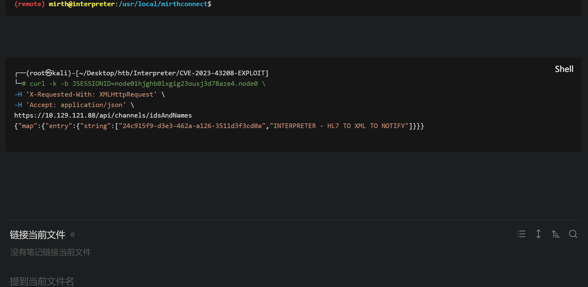
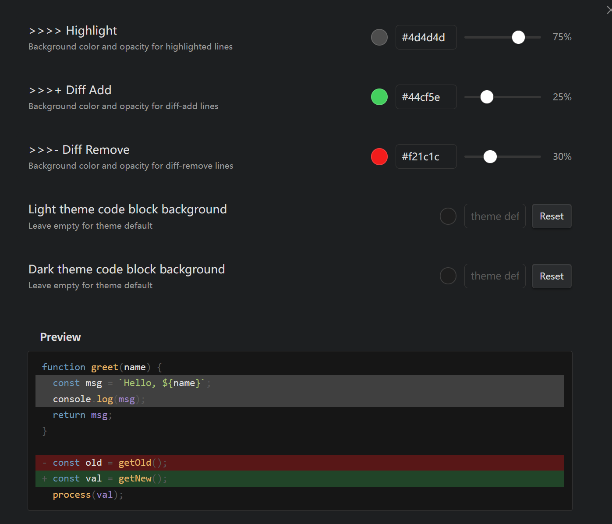
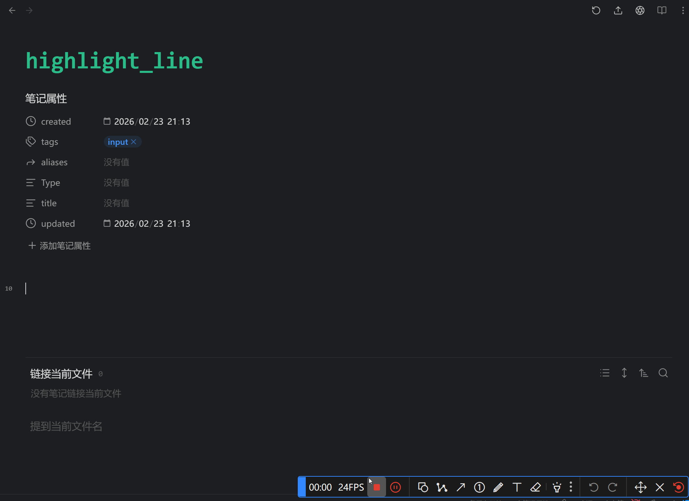
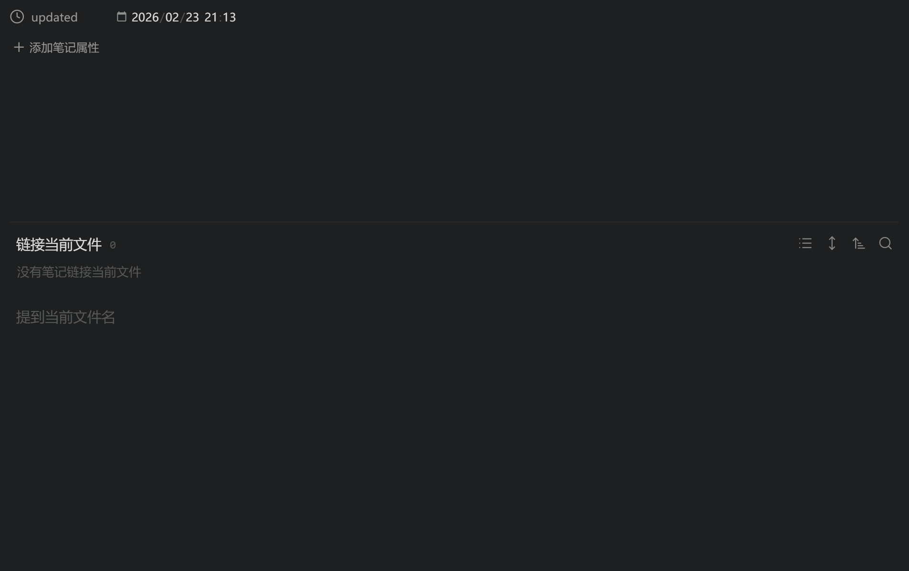
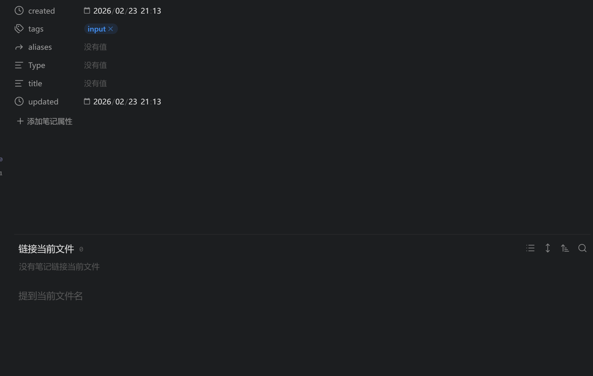

# highlight-line

[中文](readme-zh.md)


An Obsidian plugin that offers comprehensive code block enhancements. It supports highlighting specific lines with a simple prefix syntax, ANSI escape sequence rendering, shell prompt highlighting, and Burp HTTP packet visualization.

## Features
- **Code Line Highlighting and Diff View**: Add `>>>> ` (highlight), `>>>+ ` (diff-add), or `>>>- ` (diff-remove) prefixes to highlight specific lines in code blocks.
  
- **Editor and Reading Mode Support**: Real-time highlighting in Live Preview and perfect rendering in Reading View with customizable colors.
  
- **Automatic Prefix Hiding**: The `>>>` prefix is automatically hidden during rendering, keeping your code clean.
- **ANSI Escape Sequence Rendering**: Use the `ansi` code block language to perfectly parse and display standard SGR escape sequences (including 256 colors and RGB true colors) with built-in auto-contrast correction.
  
- **Shell Prompt Highlighting**: Automatically identifies and immersively highlights command-line prompts and subsequent parameters in common shell code blocks (e.g., bash, powershell, cmd).
  
- **Burp HTTP View**: Use the `burp` code block language with `===` separators to automatically present Request and Response in a side-by-side view with exclusive syntax highlighting.
  

## Usage
Add `>>>> ` (four angle brackets and a space) at the beginning of any line you want to highlight within a code block:

````markdown
```javascript
function example() {
>>>> 	console.log("This line will be highlighted");
	console.log("This line is normal");
>>>> 	return true;
}
```
````

## Credits
This project is built upon the [obsidian-sample-plugin](https://github.com/obsidianmd/obsidian-sample-plugin).


