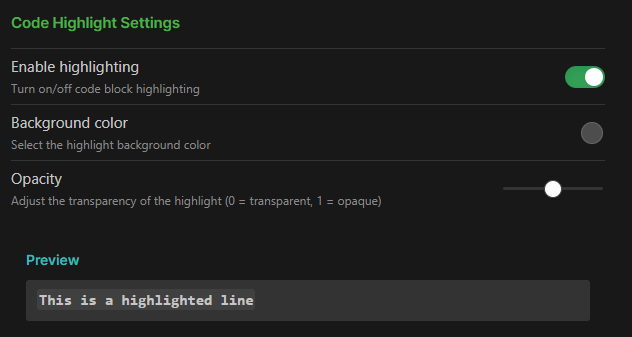
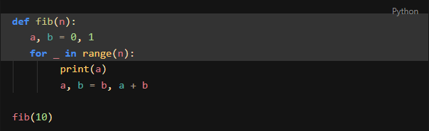

# highlight-line

[English](README.md)

这是一个用于 Obsidian 的代码块行高亮插件。它可以让您通过在行首添加 `>>>> ` 前缀来高亮代码块中的特定行。

## 功能
- **编辑模式支持**：在实时预览（Live Preview）中实时显示高亮。
- **阅读模式支持**：在导出或阅读视图中同样支持高亮显示。
- **自动隐藏前缀**：渲染时会自动隐藏 `>>>> ` 前缀。在阅读模式下，可以通过设置自定义是否显示该前缀。
- **自定义样式**：支持在设置中自定义高亮颜色的 RGBA 值。

## 致谢
本项目基于 [obsidian-sample-plugin](https://github.com/obsidianmd/obsidian-sample-plugin) 开发。

